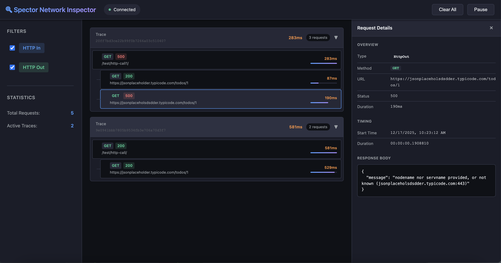

# Spector


**A lightweight network and dependency inspector for ASP.NET Core applications**

[](https://www.nuget.org/packages/Spector/)
[](https://opensource.org/licenses/MIT)
[](https://dotnet.microsoft.com/download)

[Features](#features) • [Installation](#installation) • [Quick Start](#quick-start) • [Documentation](#documentation) • [Contributing](#contributing)


---

## 🎯 Overview

Spector is a powerful yet lightweight debugging tool for ASP.NET Core applications that captures and visualizes HTTP traces in real-time. Monitor incoming requests, outgoing HTTP calls, and their dependencies through a beautiful embedded web interface—all with zero configuration required.

Perfect for development, testing, and troubleshooting API interactions without the overhead of external monitoring tools.

## ✨ Features

- 🔍 **Automatic HTTP Tracing** - Captures all incoming and outgoing HTTP requests automatically
- 📊 **Real-time Monitoring** - Live updates via Server-Sent Events (SSE)
- 🎨 **Beautiful Web UI** - Modern React-based interface embedded directly in your application
- 🔗 **Dependency Visualization** - See the complete request/response chain with parent-child relationships
- 📦 **Zero Configuration** - Works out of the box with sensible defaults
- 🚀 **Lightweight** - Minimal performance overhead, in-memory storage
- 🔐 **Development-Focused** - Designed for local development and testing environments
- 📝 **Detailed Inspection** - View headers, bodies, status codes, and timing information

## 📸 Screenshots


*Real-time HTTP trace monitoring with detailed request/response inspection*

## 🚀 Installation

Install the Spector NuGet package:

```bash
dotnet add package Spector
```

Or via Package Manager Console:

```powershell
Install-Package Spector
```

## 🏁 Quick Start

### 1. Add Spector to your ASP.NET Core application

In your `Program.cs`:

```csharp
using Spector;

var builder = WebApplication.CreateBuilder(args);

// Add Spector services
builder.Services.AddSpector();

// ... your other service registrations
builder.Services.AddControllers();
builder.Services.AddHttpClient();

var app = builder.Build();

// Use Spector middleware (add early in the pipeline)
app.UseSpector();

// ... your other middleware
app.UseAuthorization();
app.MapControllers();

app.Run();
```

### 2. Run your application

```bash
dotnet run
```

### 3. Access the Spector UI

Navigate to:

```
http://localhost:<your-port>/local-insights
```

You'll see a real-time dashboard showing all HTTP traces captured by your application! 🎉

## 📚 Documentation

### Configuration

Spector works with zero configuration, but you can customize it:

```csharp
builder.Services.AddSpector();
builder.Services.Configure<SpectorOptions>(options =>
{
    options.UiPath = "/my-custom-path";      // Default: "/local-insights"
    options.SseEndpoint = "/my-events";       // Default: "/local-insights/events"
    options.InMemoryMaxTraces = 200;          // Default: 100
    options.ActivitySourceName = "MyApp";     // Default: "Spector"
});
```

### What Gets Captured

For each HTTP request/response, Spector captures:

**Request Details:**
- HTTP method (GET, POST, PUT, DELETE, etc.)
- Full URL with query parameters
- Request headers
- Request body (when available)
- Timestamp

**Response Details:**
- HTTP status code
- Response headers
- Response body (when available)
- Duration/timing

**Trace Context:**
- Trace ID for distributed tracing
- Span ID
- Parent-child relationships between requests

### How It Works

Spector leverages ASP.NET Core's built-in diagnostics infrastructure:

1. **Activity Tracing** - Uses `System.Diagnostics.Activity` for distributed tracing
2. **Middleware** - Captures incoming HTTP requests via custom middleware
3. **HTTP Message Handler** - Intercepts outgoing HTTP calls using `IHttpMessageHandlerBuilderFilter`
4. **In-Memory Storage** - Stores recent traces in a circular buffer
5. **SSE Streaming** - Pushes real-time updates to the web UI
6. **Embedded UI** - React-based interface bundled as embedded resources

## 🎯 Use Cases

- **Local Development** - Debug API calls and inspect request/response data without external tools
- **Integration Testing** - Verify HTTP interactions during automated tests
- **Troubleshooting** - Identify slow dependencies, failing requests, or unexpected behavior
- **Learning** - Understand how your application communicates with external services
- **API Documentation** - See actual request/response examples for your endpoints

## 🛠️ Development

### Prerequisites

- [.NET 8.0 SDK](https://dotnet.microsoft.com/download/dotnet/8.0)
- [Node.js 18+](https://nodejs.org/) (for UI development)

### Building from Source

```bash
# Clone the repository
git clone https://github.com/yashwanthkkn/spector.git
cd spector

# Build the solution
dotnet build

# Run tests
dotnet test

# Pack the NuGet package
dotnet pack src/Spector/Spector.csproj -c Release -o ./nupkg
```

### Project Structure

```
network-inspector/
├── src/
│   └── Spector/              # Main library
│       ├── Config/           # Configuration options
│       ├── Handlers/         # HTTP message handlers
│       ├── Middleware/       # ASP.NET Core middleware
│       ├── Models/           # Data models
│       ├── Service/          # Background services
│       ├── Storage/          # In-memory trace storage
│       └── ui-src/           # React UI source
├── tests/
│   └── NetworkInspector.TestApi/  # Test API project
├── docs/                     # Documentation
└── nupkg/                    # Built NuGet packages
```

### UI Development

The UI is built with React, TypeScript, and Vite:

```bash
cd src/Spector/ui-src

# Install dependencies
npm install

# Run dev server
npm run dev

# Build for production
npm run build
```

## 🤝 Contributing

Contributions are welcome! Please feel free to submit a Pull Request. For major changes, please open an issue first to discuss what you would like to change.

### Contribution Guidelines

1. Fork the repository
2. Create your feature branch (`git checkout -b feature/AmazingFeature`)
3. Commit your changes (`git commit -m 'Add some AmazingFeature'`)
4. Push to the branch (`git push origin feature/AmazingFeature`)
5. Open a Pull Request

Please make sure to:
- Update tests as appropriate
- Follow the existing code style
- Update documentation for any new features

## 📋 Requirements

- .NET 8.0 or later
- ASP.NET Core application
- Modern web browser (for viewing the UI)

## ⚠️ Important Notes

- **Development Use Only** - Spector is designed for development and testing environments. Do not use in production as it stores sensitive request/response data in memory.
- **Memory Usage** - Traces are stored in memory with a configurable limit (default: 100 traces)
- **Security** - The UI endpoint is not authenticated. Ensure it's only accessible in trusted environments.

## 📝 License

This project is licensed under the MIT License - see the [LICENSE](LICENSE) file for details.

## 🙏 Acknowledgments

- Built with [ASP.NET Core](https://dotnet.microsoft.com/apps/aspnet)
- UI powered by [React](https://react.dev/) and [Vite](https://vitejs.dev/)
- Inspired by the need for lightweight, embedded debugging tools

## 📞 Support

- 🐛 **Bug Reports**: [Open an issue](https://github.com/yashwanthkkn/spector/issues)
- 💡 **Feature Requests**: [Open an issue](https://github.com/yashwanthkkn/spector/issues)
- 💬 **Questions**: [Start a discussion](https://github.com/yashwanthkkn/spector/discussions)

## 🗺️ Roadmap

- [ ] Export traces to file (JSON, HAR format)
- [ ] Filter and search capabilities
- [ ] Performance metrics and analytics
- [ ] Custom trace retention policies
- [ ] WebSocket support
- [ ] gRPC call tracing
- [ ] Trace comparison tools


**Made with ❤️ by [Yashwanth K](https://github.com/yashwanthkkn)**

If you find Spector useful, please consider giving it a ⭐ on GitHub!

